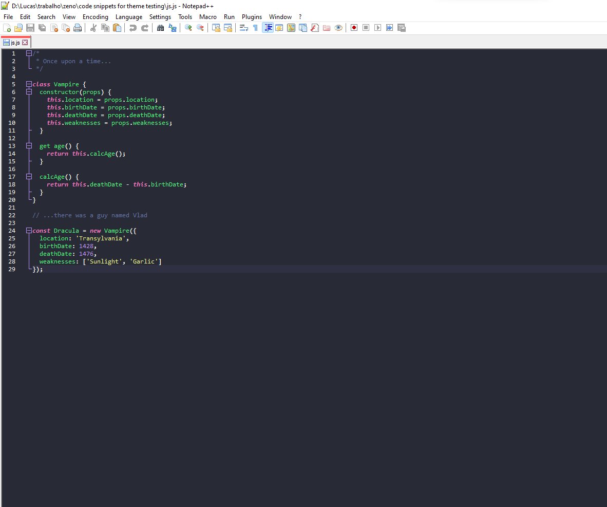

# Dracula for [Notepad++](https://notepad-plus-plus.org/)

> A dark theme for [Notepad++](https://notepad-plus-plus.org/).



## Install

Step-by-step instructions (including direct download links) are in [INSTALL.md](./INSTALL.md). The same guide is published at [draculatheme.com/notepad-plus-plus](https://draculatheme.com/notepad-plus-plus).

**Direct download (current `main` branch):** [Dracula.xml](https://raw.githubusercontent.com/dracula/notepad-plus-plus/main/generated/Dracula.xml) · [Alucard.xml](https://raw.githubusercontent.com/dracula/notepad-plus-plus/main/generated/Alucard.xml)

## Team

This theme is maintained by the following person(s) and a bunch of [awesome contributors](https://github.com/dracula/notepad-plus-plus/graphs/contributors).

| [](https://github.com/luxonauta) |
| --------------------------------------------------------------------------------------- |
| [Luxonauta](https://github.com/luxonauta)                                               |

## Community

- [Twitter](https://twitter.com/draculatheme) - Best for getting updates about themes and new stuff.
- [GitHub](https://github.com/dracula/dracula-theme/discussions) - Best for asking questions and discussing issues.
- [Discord](https://draculatheme.com/discord-invite) - Best for hanging out with the community.

## Dracula PRO

[](https://draculatheme.com/pro)

## Development

This project uses a TypeScript-based build system to generate theme XML files from structured definitions. See [build.md](./build.md) for details on how to modify themes and generate XML files.

### Quick Start

```bash
npm install
npm run build
```

## License

[MIT License](./LICENSE)
