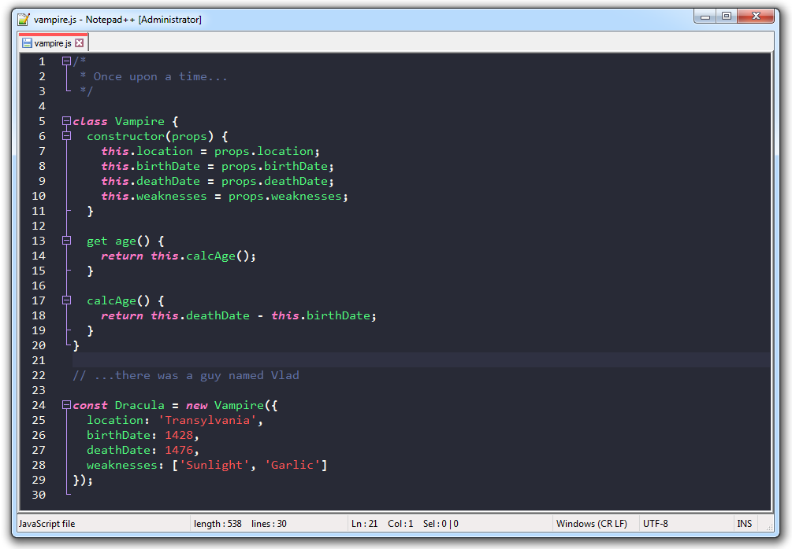

# Dracula for [Notepad++](https://notepad-plus-plus.org/)

> A dark theme for [Notepad++](https://notepad-plus-plus.org/).

## Install

All instructions can be found at [draculatheme.com/notepad-plus-plus](https://draculatheme.com/notepad-plus-plus).

## Team

This theme is maintained by the following person(s) and a bunch of [awesome contributors](https://github.com/dracula/notepad-plus-plus/graphs/contributors).

 |
--- |
[ukarim](https://github.com/ukarim)|

## License

[MIT License](./LICENSE)
